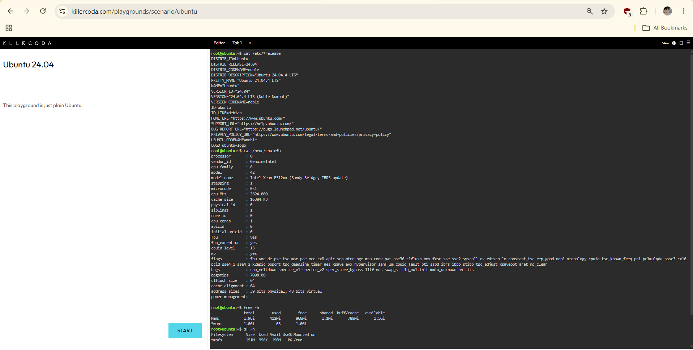

# Checkpoint 7: Linux Investigation and Cloud Migration

## Linux System Information

Using KillerCoda Playground, I gathered the following system information:

### Operating System
- **Command:** `cat /etc/*release`
- **Result:** Ubuntu 24.04.4 LTS

### CPU Information
- **Command:** `cat /proc/cpuinfo`
- **Result:** Intel Xeon E312xx processor, 1 core, 3504 MHz

### Memory
- **Command:** `free -h`
- **Result:** 1.9 GiB RAM, 1.0 GiB Swap

### Disk Space
- **Command:** `df -h`
- **Result:** 191 MB tmpfs storage

### Screenshot

## Cloud Migration

**If this Linux server were migrated to the cloud, which AWS, Azure, and GCP services could host it?**

| Cloud Provider | Service |
|----------------|---------|
| **AWS** | Amazon EC2 |
| **Azure** | Azure Virtual Machines |
| **GCP** | Compute Engine |
